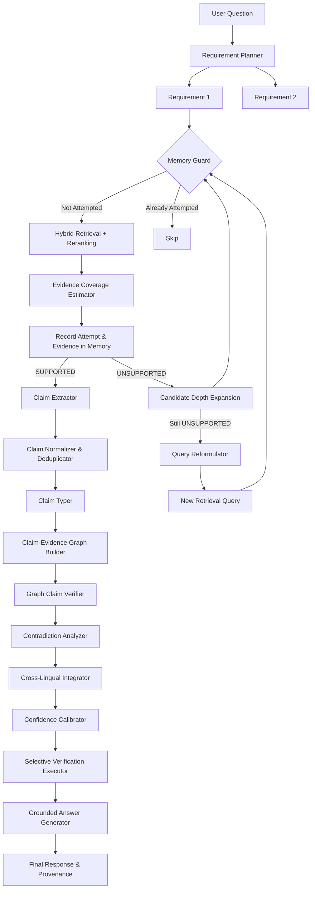

# AERIS Architecture

This document details the complete end-to-end flow of the AERIS-RAG pipeline. AERIS executes as a tightly controlled orchestration loop designed to maximize retrieval accuracy while aggressively guarding against hallucinations and contradictions.

## High-Level Orchestration Flow

## Component Details

### 1. Planning & Retrieval
- **Requirement Planner:** Breaks complex queries down to reduce semantic overlap and guide the retriever to exact facts.
- **Hybrid Retriever:** Combines `DenseRetriever` (using `all-MiniLM-L6-v2`) and `BM25Retriever` via Reciprocal Rank Fusion (RRF).
- **Reranker:** Reorders chunks using a Cross-Encoder (`cross-encoder/ms-marco-MiniLM-L-6-v2`) to surface precise contexts.
- **Adaptive Controller:** Iterates through `candidate_k` budgets and dynamically reformulates queries.
- **Memory Guard:** Tracks `(Query, Requirement ID, Candidate Depth)` state to halt cyclic loops immediately.

### 2. Information Processing (Graph Construction)
- **Claim Extractor:** Uses an LLM to pull atomic, self-contained claims from the final accumulated text.
- **Claim Normalizer:** Uses `SentenceTransformer` cosine similarity thresholds to detect identical semantic claims and merge them, reducing token waste.
- **Claim Typer:** Classifies claims (e.g., `METHOD`, `FACT`, `QUANTITATIVE`, `COMPARATIVE`) for targeted verification rules.
- **Graph Builder:** Generates a bipartite graph connecting `ExtractedClaims` to `EvidenceNodes` via robust `ClaimEvidenceEdges`.

### 3. Verification & Guardrails
- **Verifier:** Prompts the LLM to execute a strict NLI (Natural Language Inference) task determining if a specific claim is fully supported by the specific chunks attached to it.
- **Contradiction Analyzer:** Employs a zero-shot DeBERTa NLI cross-encoder model to identify `AGREEMENT`, `CONTEXTUAL_DIFFERENCE`, or `CONTRADICTION` between evidence nodes supporting the same claim.
- **Cross-Lingual Handler:** Resolves claims supported by multi-lingual evidence (preventing English claims from being improperly verified against mismatched language chunks without checking translations).
- **Selective Verification:** Rather than checking all claims exhaustively, AERIS uses historical component calibration and a Knapsack algorithmic approach to verify the highest utility claims that fit inside the configured verification budget.

### 4. Answer Generation
- **Grounded Answer Generator:** Only generates a final answer if the verified claim graph can answer the prompt. If the system fails to secure `SUPPORTED` claims, it returns `INSUFFICIENT_EVIDENCE` strictly, acting as a robust anti-hallucination firewall.

## Data Schemas

All configurations and component returns strictly adhere to immutable Pydantic models (such as `ControllerResult`, `RequirementCoverage`, `ExtractedClaim`, `ClaimVerificationResult`) guaranteeing modular predictability.
