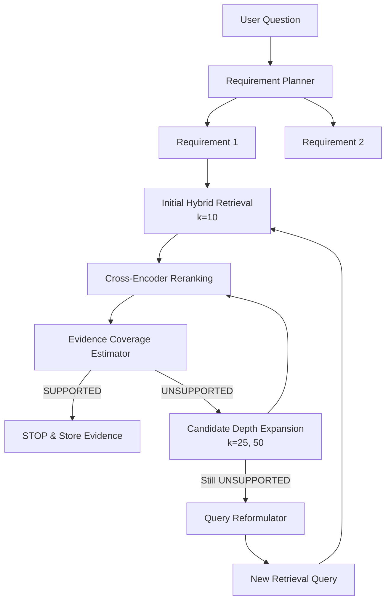

# AERIS: Improving RAG Reliability via Adaptive Evidence Acquisition

AERIS (Adaptive Evidence Retrieval and Information System) is a research-focused Retrieval-Augmented Generation (RAG) architecture designed to systematically address missing evidence and improve retrieval reliability. 

Instead of relying on single-pass retrieval or naive "retrieve more" strategies, AERIS dynamically models what information is actually required, rigorously estimates the coverage of acquired evidence, and adaptively adjusts its retrieval strategy (via candidate depth expansion and semantic query reformulation) only when evidence is genuinely missing.

## 🚀 Key Architectural Innovations

1. **Information Requirement Planner**  
   Decomposes complex user questions into atomic, distinct information requirements. Instead of one broad query, AERIS generates targeted queries for each specific requirement (e.g., *methodology*, *quantitative results*, *baselines*).

2. **Evidence Coverage Estimator**  
   Rather than treating retrieval as a black box or using simple LLM relevance judgments, AERIS employs a strict **4-dimensional scoring model**:
   - `Directness` (0.3)
   - `Relevance` (0.25)
   - `Completeness` (0.25)
   - `Evidence Type Match` (0.2)
   
   Evidence must exceed a strict threshold to be marked as `SUPPORTED`. If it doesn't, it triggers the Adaptive Controller.

3. **Adaptive Retrieval Controller**  
   The core engine for handling evidence failures. It implements a multi-tiered adaptive recovery strategy with early stopping:
   - **Tier 1 (Depth Expansion):** Automatically expands the candidate pool (e.g., `candidate_k` from 10 → 25 → 50) if initial retrieval misses the chunk.
   - **Tier 2 (Query Reformulation):** If depth expansion fails, it triggers the Query Reformulator to semantically rewrite the query (e.g., changing "How does the retriever rank?" to "What ranking algorithm is used?").
   - **Early Stopping:** Stops retrieval immediately upon hitting the `SUPPORTED` threshold to minimize computational cost, latency, and context noise.

4. **Hybrid Retrieval + Cross-Encoder Reranking**  
   - **Dense Retrieval:** `all-MiniLM-L6-v2`
   - **Sparse Retrieval:** BM25
   - **Fusion:** Reciprocal Rank Fusion (RRF)
   - **Reranker:** `cross-encoder/ms-marco-MiniLM-L-6-v2`

## 🏗️ Architecture Diagram



## 🛠️ Installation & Setup

1. **Clone the repository**
   ```bash
   git clone git@github.com:Saravanan2005real/aeris-improving-rag-reliability-via-adaptive-evidence-acquisition.git
   cd aeris-improving-rag-reliability-via-adaptive-evidence-acquisition
   ```

2. **Create a virtual environment and install dependencies**
   ```bash
   python -m venv .venv
   # On Windows: 
   .venv\Scripts\activate
   # On Mac/Linux:
   source .venv/bin/activate
   
   pip install -r requirements.txt
   ```

3. **Setup Ollama**
   AERIS relies on local LLMs for planning and evidence estimation. Ensure you have [Ollama](https://ollama.com/) installed and running.
   ```bash
   ollama pull llama3.2:latest
   ```

4. **Environment Variables**
   Create a `.env` file in the root directory:
   ```env
   OLLAMA_HOST=http://localhost:11434
   OLLAMA_MODEL=llama3.2:latest
   ```

## 🧪 Running the Adaptive Retrieval Test

To observe the adaptive candidate expansion and query reformulation in action:

```bash
python scripts/test_adaptive_retrieval.py data/raw/test_document.pdf "How does the retriever work?"
```

**Expected Behavior:**
- **Requirement 1** will demonstrate **Tier 1 Adaptation**: Initial retrieval at `k=10` will fail, triggering an expansion to `k=25`, which successfully uncovers the missing evidence and triggers an early stop.
- **Requirement 2** will demonstrate **Tier 2 Adaptation**: The original query will fail at all depths (`10, 25, 50`). The controller will seamlessly rewrite the query, and the new semantic formulation will successfully retrieve and validate the evidence.
